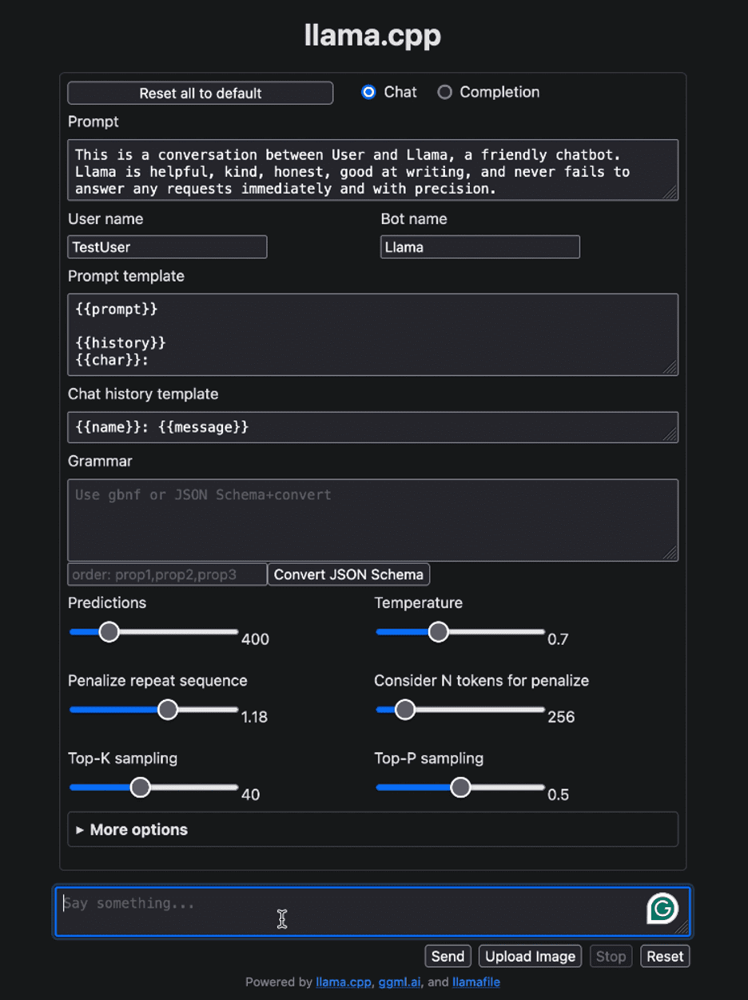

## Objective

This document outlines the various open-source libraries, tools, and best practices for deploying Large Language Models (LLMs) in a self-hosted production environment on Google Cloud Platform (GCP). The primary focus is on ensuring high security by avoiding the use of third-party services.

## Compare Open-Source Tools for Model Serving

<table style={{ borderCollapse: 'collapse', width: '100%' }}>
  <thead>
    <tr>
      <th style={{ border: '1px solid black', padding: '8px' }}>Tool</th>
      <th style={{ border: '1px solid black', padding: '8px' }}>Focus</th>
      <th style={{ border: '1px solid black', padding: '8px' }}>Model Support</th>
      <th style={{ border: '1px solid black', padding: '8px' }}>Usage</th>
    </tr>
  </thead>
  <tbody>
    <tr>
      <td style={{ border: '1px solid black', padding: '8px' }}>vLLM</td>
      <td style={{ border: '1px solid black', padding: '8px' }}>GPU</td>
      <td style={{ border: '1px solid black', padding: '8px' }}>Limited Models</td>
      <td style={{ border: '1px solid black', padding: '8px' }}>GPU Server</td>
    </tr>
    <tr>
      <td style={{ border: '1px solid black', padding: '8px' }}>Llama.cpp</td>
      <td style={{ border: '1px solid black', padding: '8px' }}>CPU</td>
      <td style={{ border: '1px solid black', padding: '8px' }}>Any Models</td>
      <td style={{ border: '1px solid black', padding: '8px' }}>CPU Server</td>
    </tr>
    <tr>
      <td style={{ border: '1px solid black', padding: '8px' }}>Llamafile</td>
      <td style={{ border: '1px solid black', padding: '8px' }}>CPU</td>
      <td style={{ border: '1px solid black', padding: '8px' }}>Any Models</td>
      <td style={{ border: '1px solid black', padding: '8px' }}>CPU Server</td>
    </tr>
    <tr>
      <td style={{ border: '1px solid black', padding: '8px' }}>Ollama</td>
      <td style={{ border: '1px solid black', padding: '8px' }}>CPU</td>
      <td style={{ border: '1px solid black', padding: '8px' }}>Any Models</td>
      <td style={{ border: '1px solid black', padding: '8px' }}>Developer (Build/Test)</td>
    </tr>
  </tbody>
</table>

## Deploy LLMs Model using vLLM

### System Requirements

- GPU accelerator for fast inference latency
- GPU with large memory (e.g., NVIDIA A100)
- Use a system with resources matching the model's fine-tuning requirements
- Using vLLM (version `0.6.0`), providing an [OpenAI compatible server](https://docs.vllm.ai/en/latest/serving/openai_compatible_server.html)

### Deploy the Fine-Tuned Model to a Development or Local Environment

Assuming you have:

- [vLLM==0.6.0](https://docs.vllm.ai/en/latest/getting_started/installation.html)
- Fine-tuned model files in a directory called `finetuned_model`

You can deploy it locally using the following command:

```bash
vllm serve finetuned_model
```

> **Note:**
> - The default model name for API calls will be `finetuned_model` unless overridden with flags.
> - Access the vLLM server at `localhost`.
> - Refer to the [official documentation](https://docs.vllm.ai/en/latest/serving/openai_compatible_server.html#command-line-arguments-for-the-server) for available flags.

### Deploy the Fine-Tuned Model to a Production Environment

#### VM Instance

- Use the [official vLLM Docker image](https://docs.vllm.ai/en/latest/serving/deploying_with_docker.html) for running a fine-tuned model on a VM instance (vLLM `0.6.0`).
- Prerequisites:
  - [Docker](https://docs.docker.com/engine/install/)
  - [NVIDIA Container Toolkit](https://docs.nvidia.com/datacenter/cloud-native/container-toolkit/latest/install-guide.html)
  - Fine-tuned model files in `finetuned_model`

Run the following Docker command, updating the `--served-model-name` flag to override the model name:

```docker
docker run --runtime nvidia --gpus all \
  -v "./finetuned_model:/mnt/models" \
  -p 8000:8000 --ipc="host" \
  vllm/vllm-openai:latest \
  --model "/mnt/models" \
  --served-model-name "CHANGEME"
```

#### Kubernetes Cluster

We recommend using [KServe](https://github.com/kserve/kserve) when deploying a fine-tuned model to a [Kubernetes](https://kubernetes.io/) cluster, due to the [integrated vLLM runtime](https://kserve.github.io/website/latest/modelserving/v1beta1/llm/huggingface/).

Ensure you have:

- A Kubernetes cluster with [KServe installed](https://kserve.github.io/website/latest/admin/serverless/serverless/)
- At least one [NVIDIA GPU node with appropriate drivers](https://kubernetes.io/docs/tasks/manage-gpus/scheduling-gpus/)

Use the following manifest to deploy the model from a cloud storage bucket:

```yaml
apiVersion: serving.kserve.io/v1beta1
kind: InferenceService
metadata:
  name: "CHANGEME"
spec:
  predictor:
    containers:
    - name: "main"
      image: "kserve/vllmserver:latest"
      command:
      - "python3"
      - "-m"
      - "vllm.entrypoints.openai.api_server"
      args:
      - "--port"
      - "8000"
      - "--model"
      - "/mnt/models"
      - "--served-model-name"
      - "CHANGEME"
      env:
      - name: "STORAGE_URI"
        value: "CHANGEME"
      resources:
        limits:
          nvidia.com/gpu: "1"
```

Make sure to update the values for:

- `metadata.name` for your model inference service
- `STORAGE_URI` for your cloud storage URI
- `--served-model-name` for the model name used in API calls

## Deploy LLMs Model using Ollama

### Deploy the Fine-Tuned Model to a Development or Local Environment

### Deploy the Fine-Tuned Model to a Production Environment

Use the following Dockerfile to deploy Ollama to production:

```docker
FROM ollama/ollama:0.3.6

ENV OLLAMA_HOST 0.0.0.0:8080
ENV OLLAMA_MODELS /models
ENV OLLAMA_DEBUG false
ENV OLLAMA_KEEP_ALIVE -1
ENV MODEL gemma2:9b

RUN ollama serve & sleep 5 && ollama pull $MODEL 

ENTRYPOINT ["ollama", "serve"]
```

Create an artifact repository on GCP:

```bash
gcloud artifacts repositories create ollama \
  --repository-format=docker \
  --location=us-central1
```

Build the image and submit it:

```bash
gcloud builds submit \
  --tag us-central1-docker.pkg.dev/[PROJECT-NAME]/ollama/ollama-gemma \
  --machine-type e2-highcpu-32
```

Create a service account:

```bash
gcloud iam service-accounts create ollama \
  --display-name="Service Account for Ollama Cloud Run service"
```

Activate the model:

```bash
gcloud beta run deploy ollama-gemma \
  --image us-central1-docker.pkg.dev/[PROJECT-NAME]/ollama/ollama-gemma \
  --concurrency 4 \
  --cpu 8 \
  --set-env-vars OLLAMA_NUM_PARALLEL=4 \
  --max-instances 2 \
  --memory 32Gi \
  --no-allow-unauthenticated \
  --no-cpu-throttling \
  --service-account ollama@[PROJECT-NAME].iam.gserviceaccount.com \
  --timeout=600
```

The model can now be accessed using `curl`:

```bash
curl -H "Authorization: Bearer $(gcloud auth print-identity-token)" \
     -H "Content-Type: application/json" \
     https://ollama-gemma-wruklsvs3a-uc.a.run.app/api/generate -d '{
       "model": "gemma2:9b",
       "prompt": "Why is the sky blue?",
       "stream": false
     }'
```

## Deploy LLMs Model using Llamafile

### Step 1: Download the Llamafile

Download the `llava-v1.5-7b-q4.llamafile` (3.97 GB) executable from [here](https://huggingface.co/jartine/llava-v1.5-7B-GGUF/resolve/main/llava-v1.5-7b-q4.llamafile?download=true).

### Step 2: Grant Execution Permission

For macOS, Linux, or BSD users:

```bash
chmod +x llava-v1.5-7b-q4.llamafile
```

### Step 3: Run the Llamafile

```bash
./llava-v1.5-7b-q4.llamafile -ngl 9999
```

### Step 4: Interact with the UI

After running, the Llamafile will open the user interface at [http://localhost:8080](http://localhost:8080/).


